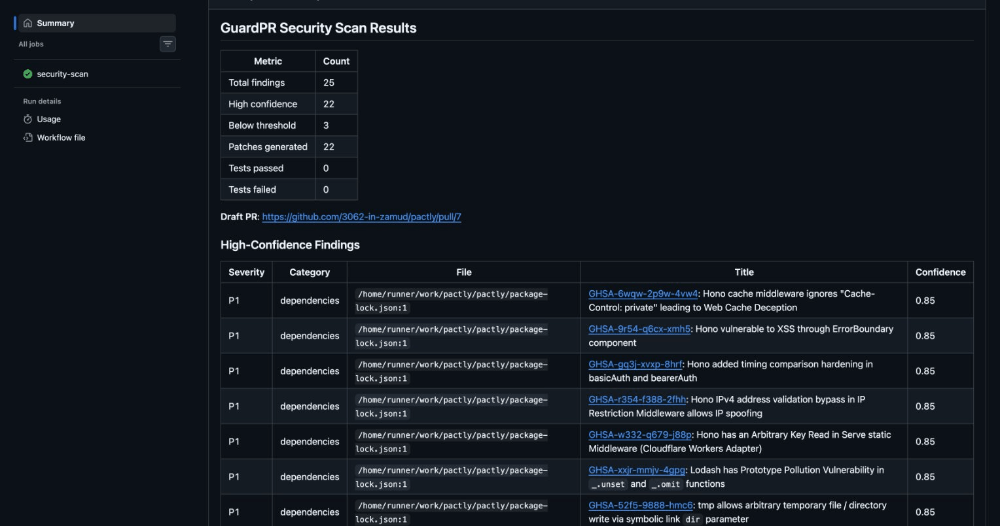
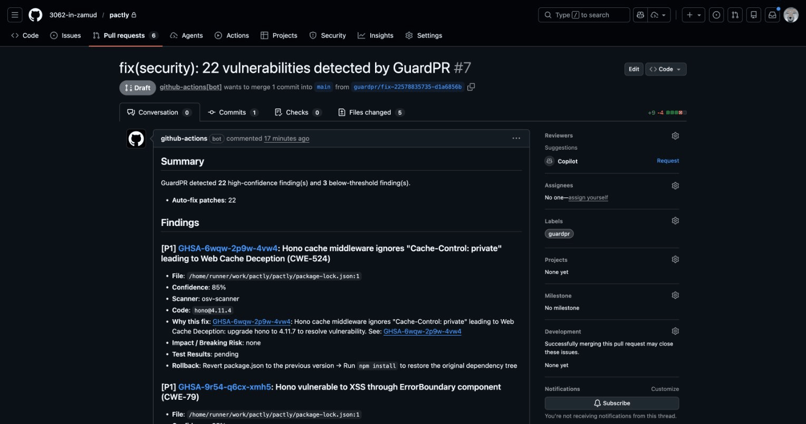
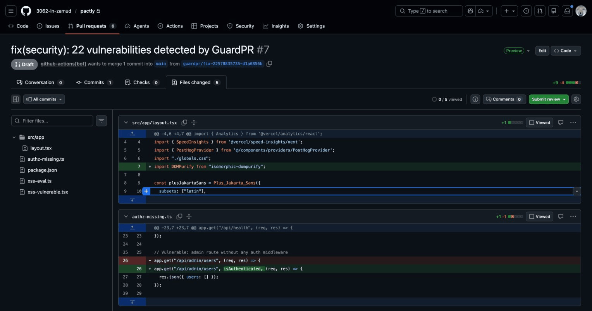

<p align="center">
  <h1 align="center">GuardPR</h1>
  <p align="center">GitHub リポジトリのセキュリティ脆弱性を自動検出し、修正 PR を生成する GitHub Action</p>
  <p align="center">
    <a href="https://github.com/3062-in-zamud/guardpr/actions"></a>
    <a href="LICENSE"></a>
    <a href="https://github.com/3062-in-zamud/guardpr/releases"></a>
  </p>
  <p align="center">
    <a href="#クイックスタート">クイックスタート</a> · <a href="#機能">機能</a> · <a href="docs/">ドキュメント</a> · <a href="README.md">English</a>
  </p>
</p>

---

## GuardPR とは

GuardPR は、セキュリティ脆弱性の検出、修正パッチの生成、テストによる検証、Draft PR の作成までを 1 回のワークフロー実行で自動化する GitHub Action です。外部サービスへのデータ送信は一切ありません。

## デモ

GuardPR は脆弱性を検出し、修正 PR を自動生成します:


*Step Summary: 検出された脆弱性と信頼度スコアの一覧*


*Draft PR: 検出結果の詳細、修正内容、ロールバック手順*


*自動パッチ: XSS 対策の DOMPurify 追加、未保護ルートへの認証ミドルウェア追加*

## クイックスタート

**1.** リポジトリにワークフローファイルを追加します。

```yaml
# .github/workflows/guardpr.yml
name: GuardPR Security Scan
on:
  push:
    branches: [main]
  pull_request:
    branches: [main]

permissions:
  contents: write
  pull-requests: write

jobs:
  security-scan:
    runs-on: ubuntu-latest
    steps:
      - uses: actions/checkout@v4

      - uses: 3062-in-zamud/guardpr@v1
        with:
          github-token: ${{ secrets.GITHUB_TOKEN }}
```

**2.** コミットしてプッシュします。

**3.** **Actions** タブでスキャン結果を、**Pull Requests** タブで Draft 修正 PR を確認します。

## 機能

| カテゴリ | 検出対象 | 修正方法 | 対応ファイル |
|----------|----------|----------|-------------|
| **シークレット** | API キー、トークン、秘密鍵、接続文字列 | 通知のみの PR（diff にシークレットを含まない） | 全ファイル（Gitleaks） |
| **依存関係** | 依存パッケージの既知の CVE | 修正バージョンへのバンプ | `package-lock.json`, `yarn.lock`, `pnpm-lock.yaml`, `Gemfile.lock`, `poetry.lock`, `go.sum`, `Cargo.lock`, `composer.lock`, `requirements.txt` |
| **XSS** | `dangerouslySetInnerHTML`, `innerHTML`, `eval()`, `javascript:` URL | サニタイズ処理の追加または安全な代替への置換 | `.ts`, `.tsx`, `.js`, `.jsx` |
| **認可** | 認証ミドルウェアが不足しているルート | ルートハンドラへのミドルウェア追加 | Express, Next.js |

すべての検出結果に**信頼度スコア**が付与されます。設定した閾値（デフォルト: 0.9）以上の検出結果のみが修正 PR を生成します。

## Community vs Pro

すべてのコア機能は無料かつオープンソースです。追加機能を備えた Pro プランを予定しています。詳細は別途発表します。

## 設定

### 入力パラメータ

| 入力 | 必須 | デフォルト | 説明 |
|------|------|-----------|------|
| `github-token` | はい | -- | GitHub API アクセス用トークン |
| `config-path` | いいえ | `.guardpr.yml` | 設定ファイルのパス |
| `confidence-threshold` | いいえ | `0.9` | 最小信頼度スコア（0.0 - 1.0） |
| `create-pr` | いいえ | `true` | 修正の Draft PR を作成するか |
| `run-tests` | いいえ | `true` | パッチ適用後にテストを実行するか |
| `test-command` | いいえ | `npm test` | 実行するテストコマンド |
| `scanners` | いいえ | `all` | 実行するスキャナー（カンマ区切り） |

### 出力

| 出力 | 説明 |
|------|------|
| `findings-count` | 検出結果の総数 |
| `high-confidence-count` | 信頼度閾値以上の検出数 |
| `low-confidence-count` | 信頼度閾値未満の検出数 |
| `pr-url` | 作成された Draft PR の URL |
| `pr-number` | 作成された Draft PR の番号 |
| `audit-artifact-name` | アップロードされた監査ログのアーティファクト名 |

### .guardpr.yml

リポジトリのルートに `.guardpr.yml` を作成して動作をカスタマイズできます。

```yaml
confidenceThreshold: 0.9
createPr: true
runTests: true
testCommand: "npm test"

scanners:
  secrets:
    enabled: true
  dependencies:
    enabled: true
  xss:
    enabled: true
    customSanitizers:
      - mySanitize
  authz:
    enabled: true
    framework: auto
    authMiddleware:
      - isAuthenticated
      - isAdmin
    protectedRoutes:
      - pattern: "/api/admin/*"
        requiredMiddleware: ["isAdmin"]
      - pattern: "/api/*"
        requiredMiddleware: ["isAuthenticated"]

patching:
  maxLinesPerPatch: 50
  maxFilesPerPatch: 5
```

全設定項目の詳細は [docs/configuration.md](docs/configuration.md) を参照してください。

## 仕組み

```
1. スキャン     Gitleaks + OSV-Scanner + 組み込み XSS/Authz ルール
                                  |
2. スコアリング  文脈分析による信頼度スコアリング
                                  |
3. パッチ生成    高信頼度の検出結果に対する修正パッチを生成
                                  |
4. テスト       パッチを適用してテストスイートで検証
                                  |
5. PR 作成      説明、チェックリスト、監査証跡付きの Draft PR を作成
```

すべての処理は GitHub Actions ランナー上で実行されます。コードや検出結果が外部に送信されることはありません。パイプラインの詳細は [docs/architecture.md](docs/architecture.md) を参照してください。

## セキュリティとプライバシー

- **外部データ送信なし**: すべての処理は Actions ランナー上で実行。OSV-Scanner のみがパッケージ名で OSV.dev に問い合わせます（ソースコードは送信しません）。
- **5 層シークレット防御**: 検出、ランタイムマスキング、パッチ抑制、監査ログ墨消し、PR 説明文の墨消し。
- **バイナリ整合性検証**: スキャナーバイナリは実行前に SHA-256 チェックサムで検証。
- **最小権限**: `contents: write`、`pull-requests: write`、`actions: read` のみ。

詳細は [SECURITY.md](SECURITY.md) を参照してください。

### 必要な権限

```yaml
permissions:
  contents: write        # ブランチの作成と修正コミットのプッシュ
  pull-requests: write   # Draft PR の作成、ラベルの追加
  # actions: read はアーティファクトアップロードに暗黙的に必要
```

## 使用例

- [基本ワークフロー](examples/basic-workflow.yml) -- 最小構成、全てデフォルト設定。
- [高度なワークフロー](examples/advanced-workflow.yml) -- マトリクス戦略、スキャナーごとの実行、ステップサマリー。

## ドキュメント

| ドキュメント | 説明 |
|-------------|------|
| [はじめに](docs/getting-started.md) | インストール、基本・高度な設定、トラブルシューティング |
| [設定リファレンス](docs/configuration.md) | `.guardpr.yml` の全オプション解説 |
| [検出ルール](docs/detection-rules.md) | 全検出ルール、信頼度要因、修正戦略 |
| [アーキテクチャ](docs/architecture.md) | システム設計、パイプラインデータフロー、コンポーネント図 |
| [セキュリティポリシー](SECURITY.md) | 脆弱性報告、セキュリティ設計、権限モデル |
| [ADR](docs/adr/) | アーキテクチャ決定記録 |

## コントリビューション

開発環境のセットアップ、プロジェクト構成、貢献ガイドラインについては [CONTRIBUTING.md](CONTRIBUTING.md) を参照してください。

## ライセンス

[MIT](LICENSE)
